# 🧾 영수증 이미지 인식을 통한 자동 정산 서비스
<p align="center">
  
</p>

**공개SW프로젝트 2분반 7조**
> 영수증 이미지를 업로드하고, 원하는 정산 참여자를 입력하면,                             
> 1/N 정산 또는 항목별 정산으로 원하는 정산 방식에 따라 정산 결과를 산출해주고,                                           
> 엑셀 파일로 내보내거나 카카오톡으로 공유할 수 있는 웹 기반 자동 정산 서비스입니다.

---

## 👨‍👩‍👧‍👦 팀원 소개

| 이름 | 학과 | 학번 | GitHub |
|------|------|------|--------|
| 모수진 | 컴퓨터공학전공 | 2022111980 | [https://github.com/mo-sujin](https://github.com/mo-sujin) |
| 박현수 | 컴퓨터공학전공 | 2021111933 | [https://github.com/phs314](https://github.com/phs314) |
| 최희수 | 컴퓨터공학전공 | 2023112540 | [https://github.com/chs2540](https://github.com/chs2540) |
| 하승연 | 컴퓨터공학전공 | 2023111312 | [https://github.com/yeonthusiast](https://github.com/yeonthusiast) |

---

## 🛠️ 사용 기술 스택

<p align="left">
  <!-- Frontend -->
  
  
  
  
</p>

<p align="left">
  <!-- Backend -->
  
  
  
  
</p>

<p align="left">
  <!-- OCR / AI -->
  
  
  
</p>

---

## 📁 프로젝트 구조

<pre> 2025-1-OSSP-chillguys/
   ├── backend/ # Django 백엔드
   │   ├── manage.py
   │   ├── api/
   │   │  ├── views.py
   │   │  └── ...
   │   ├── .env.example # 백엔드 환경 변수 템플릿
   │   └── command.txt # 실행 명령어 모음
   │
   ├── frontend/ # React 프론트엔드
   │   ├── src/
   │   │  ├── App.tsx
   │   │  └── ...   
   │   └── .env.example # 프론트엔드 환경 변수 템플릿
   │
   ├── docs/ # 문서 및 실행 이미지 폴더
   │   ├── images
   │   └── 각종 서류들
   │
   └── README.md </pre>

---

## ⚙️ 실행 방법

### ✅ 환경 변수 설정

각 폴더(`frontend/`, `backend/`)에 존재하는 `.env.example` 파일을 복사해서 `.env` 파일을 생성하세요.

```bash
cp .env.example .env
```

#### ✅ Frontend
```bash
cd frontend
pnpm install
pnpm run dev
```
개발 서버는 기본적으로 http://localhost:5173 에서 실행됩니다.

#### ✅ Backend
```bash
cd backend
```
**💡실행 명령어는 backend/command.txt 참고**  
개발 서버는 기본적으로 http://localhost:8000 에서 실행됩니다.  

스웨거 문서는 http://localhost:8000/swagger 참고  

---

## 🖼️ 실행 화면 예시
### 📌 랜딩 페이지
홈 화면입니다. 시작하기 버튼을 누르면 실행을 시작합니다.  
로고와 슬로건, 팀명으로 만든 바코드를 디자인하였습니다. 
<p align="center">
   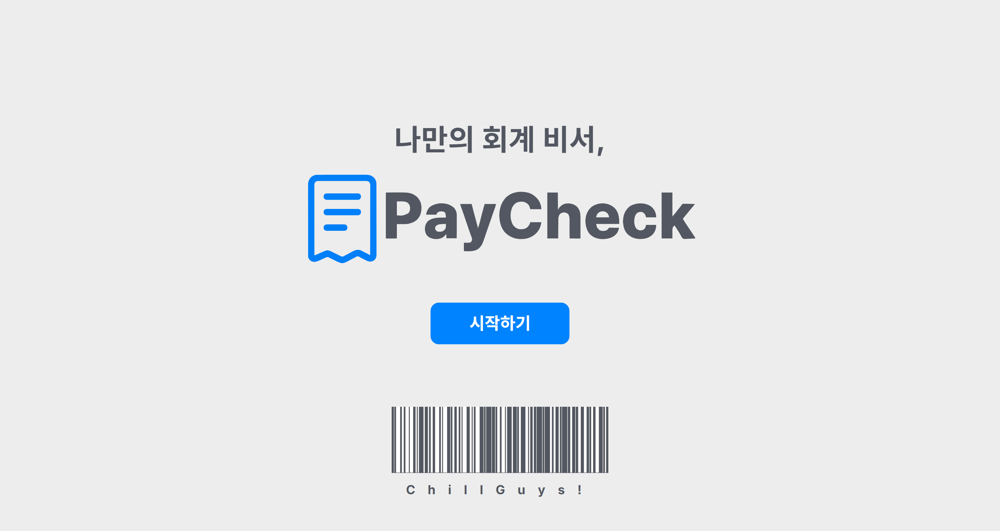
</p>

### 📌 메인 페이지
영수증을 원하는 수만큼 업로드하고, 참여자와 정산 방식을 결정합니다.
모든 항목을 입력하면 PayCheck 버튼이 활성화됩니다.  
<p align="center">
   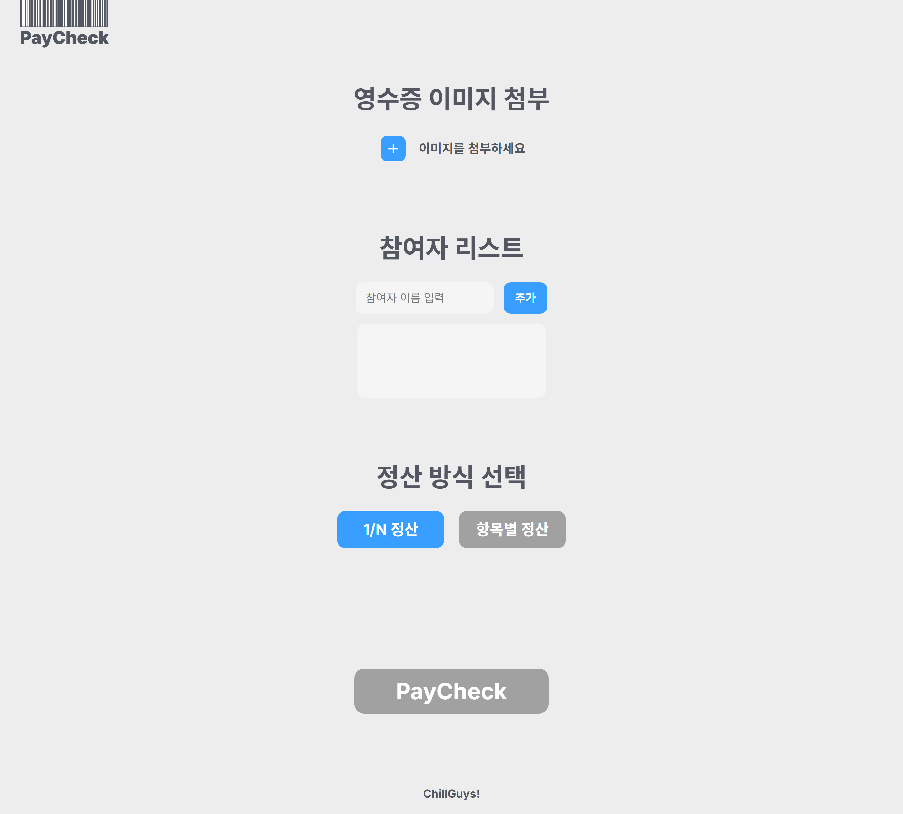
   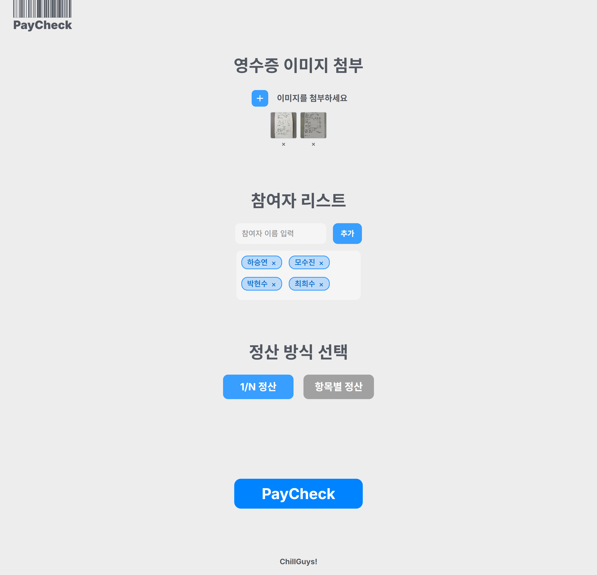
</p>
  
### 📌 로딩
영수증을 이미지 전처리 - OCR - 후처리의 과정을 거쳐 분석합니다.  
<p align="center">
  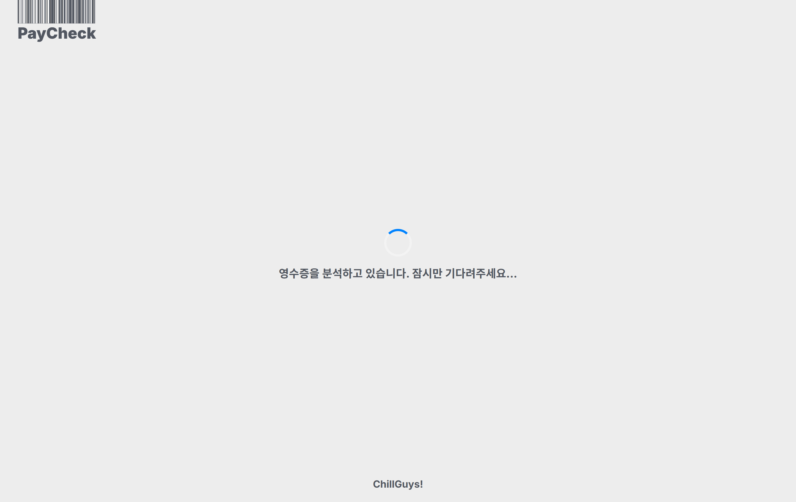
</p> 
  
### 📌 결과 페이지(1/N 정산)
1/N 정산을 선택했을 경우의 결과 화면입니다.  
작성한 참여자 명단에 균등하게 산출한 총 정산 금액이 분배됩니다.  
**엑셀로 내보내기** 버튼을 누르면 엑셀 파일로 정산 내역이 다운로드됩니다.  
<p align="center">
   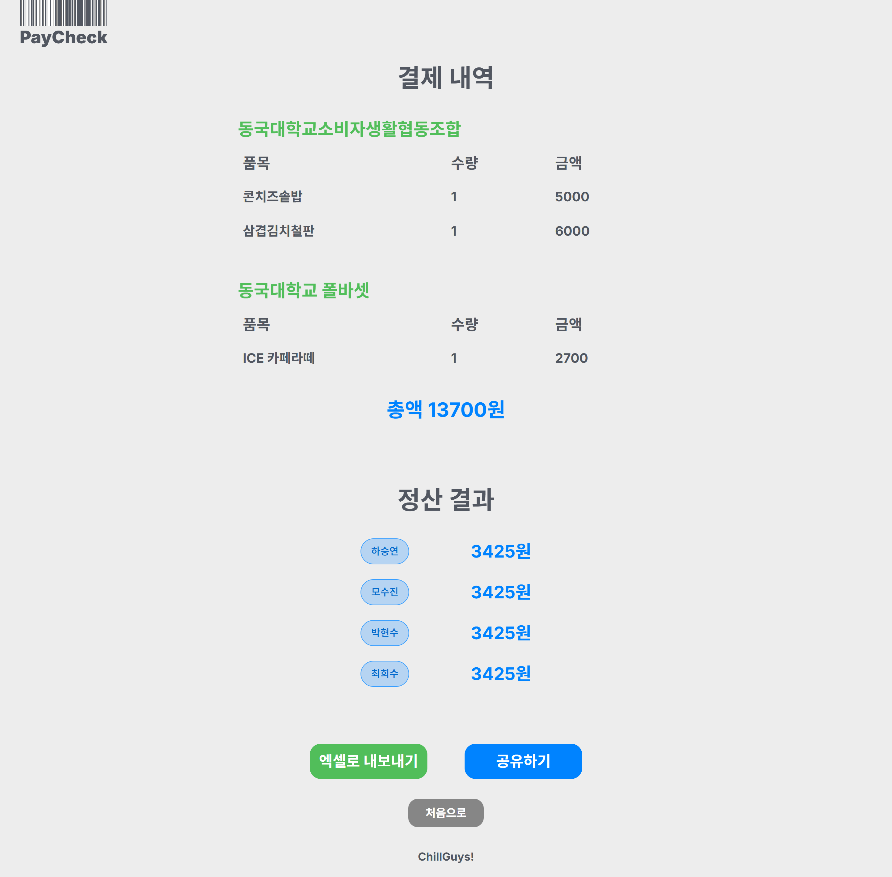
   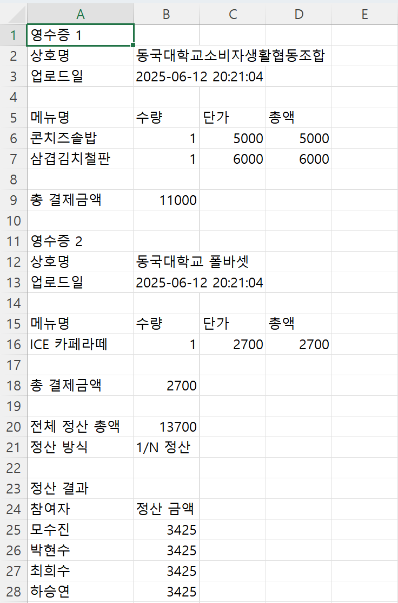
</p>
  
### 📌 결과 페이지(항목별 정산)
항목별 정산을 선택했을 경우의 결과 화면입니다.  
항목별로 참여자 입력칸에 정산을 수행할 참여자를 추가합니다.(사전에 입력한 참여자가 아니면 추가가 되지 않습니다.)  
<p align="center">
   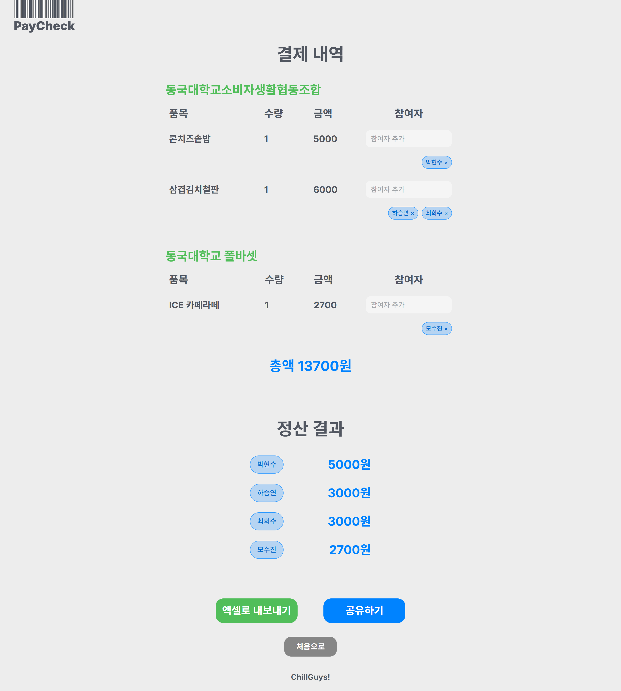
   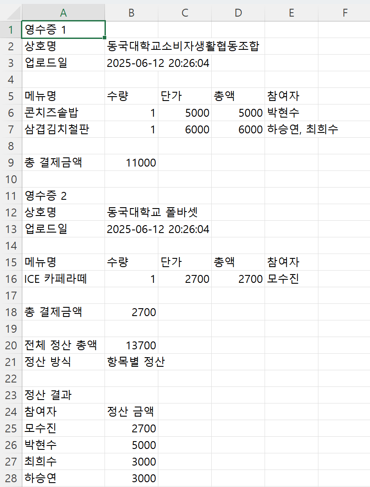
</p>
  
### 📌 카카오 공유
**공유하기** 버튼을 누르면 계좌 정보를 입력하는 팝업 창이 뜹니다.  
입력 후 열린 카카오톡 창에서 전송을 원하는 상대를 선택하면 계좌 정보와 함께 정산 내역 메시지가 전송되어 간편하게 송금이 가능합니다.  
<p align="center">
   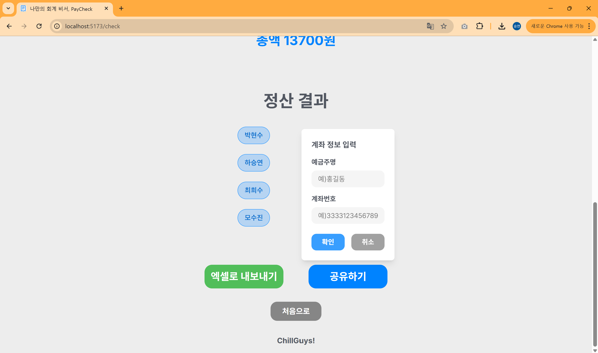
   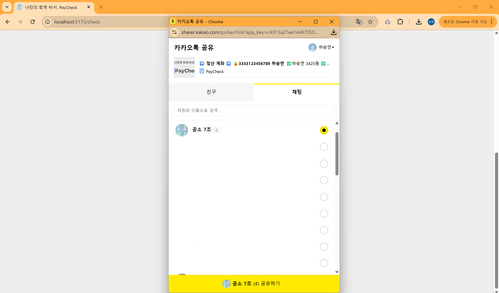
</p>
  
<p align="center">
   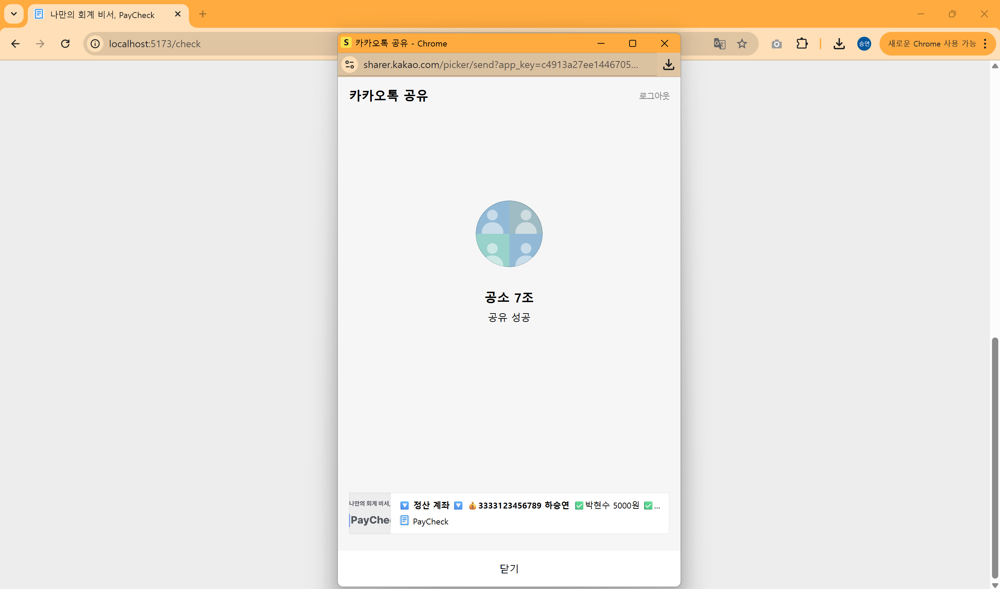
   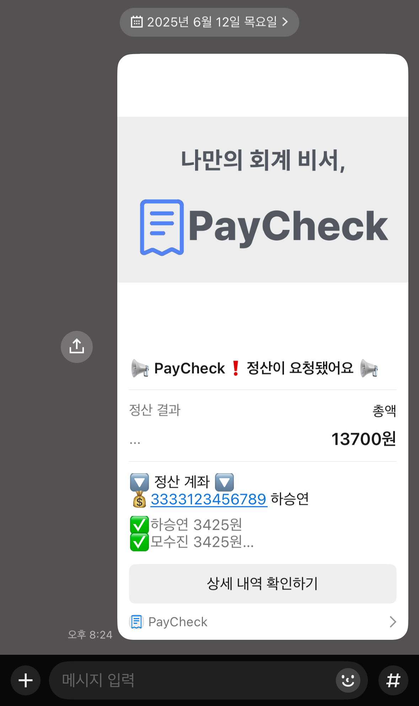
</p>
  
### 📄 스웨거 문서
<p align="center">
  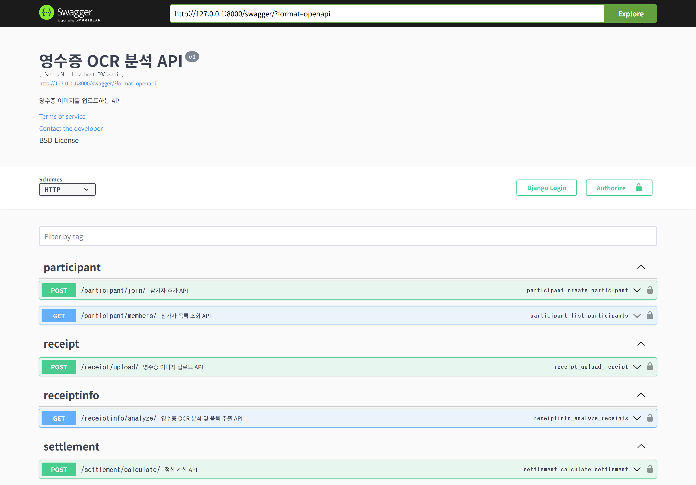
</p>
  
---
  
